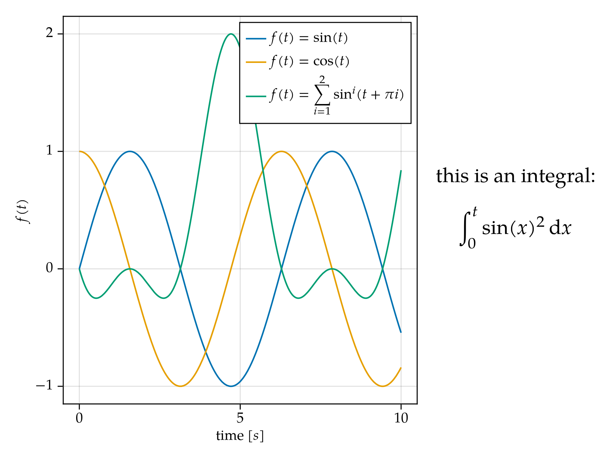

# MakieTypstEngine
Use typst strings in Makie!

## Installation
This package is currently unregistered, as it is still in early phases of development, and contains type piracy (see `src/piracy.jl`) for methods in Makie and the `TypstString` from Typstry.

To install it, add it with the url:
```julia
julia> using Pkg: add

julia> add("https://github.com/henrik-wolf/MakieTypstEngine.jl")

julia> using MakieTypstEngine
```

Whenever the package loads, it will run a `cargo build -r` command which locally compiles a rust based cli tool which is used to layout your typst strings. As such, for this package to work, you need to have rust and cargo installed and available on your system. This process can take a few ten seconds on the first load.

## Useage
This package provides mostly glue code that enables you to put any (with some restrictions) `TypstString` wherever Makie would have previously only allowed
normal `Strings`, `RichText` or `LaTeXString`:

```julia
using CairoMakie
using MakieTypstEngine
font = MakieTypstEngine.MTEFont("TeXGyrePagella")

typst_string = typst"""
this is an integral:
$ integral_0^t sin(x)^2 dif x $
"""

fig = Figure(fonts = (; regular = font))
Label(fig[1, 2], typst_string, fontsize = 20, tellheight = false)
ax = Axis(fig[1, 1], xlabel = typst"time $[s]$", ylabel = typst"$f(t)$")
lines!(ax, 0 .. 10, sin, label = typst"$f(t) = sin(t)$")
lines!(ax, 0 .. 10, cos, label = typst"$f(t) = cos(t)$")
lines!(ax, 0 .. 10, t -> sin(t + π) + sin(t + 2π)^2, label = typst"$ f(t) = sum_(i=1)^2 sin^i (t+pi i) $")
axislegend(ax)
fig
```
will give you something like:


## Fonts
MakieTypstEngine makes use of the font styling options which are exposed in Makie. (such as `fontsize`, `color` or `align`). The way they are handled are however not universal, some are passed to and retrieved from, typst, while others, are applied after layouting.

The most important setting to get right is the `font` setting, as it decides the overall placement of the characters.

The way Makie handles fonts is specified in the [fonts explanation](https://docs.makie.org/stable/explanations/fonts). Essentially, every string that is either a path or a font name gets passed through `Makie.to_font(name_or_path)` and converted into a `FreeTypeAbstraction.FTFont` object,
before it reaches the `MakieTypstEngine` layer.


Enabling the full round-trip from Makie to Typst and back to Makie proves slightly tricky, due to the
different ways they handle fonts. As such, making your fonts with Makie might require some small user intervention in the shape of overwriting dispatches to
```julia
MakieTypstEngine.to_typstfont(::Val{Symbol(your_fonts_family_name)}, font)
MakieTypstEngine.to_mathfont(::Val{Symbol(your_fonts_family_name)}, font)
```
(to get from makie to typst) as well as
```julia
MakieTypstEngine.from_typst_font(::Val{Symbol(your_fonts_family_name)}, font_dict)
```
to map the fonts used in typst back to fonts that Makie understands.

For more details, please consult the relevant docstrings. In general, both the `to_typstfont`, as well as `to_mathfont` return a string that, when interpolated into a typst document at `#set text(font: $typst_font)` and `#show math.equation: set text(font: \$math_font)` respectively, make the typst compiler resolve to the correct fonts for both regular and math text. 

`from_typst_font` receives as dispatch the strings like they have been passed to the compiler, that is, the result of `to_typstfont` or `to_mathfont`, and a dictionary which contains information about the font that was used to render it. It then maps this information (mostly in `font_dict["variant"]["style"]` and `font_dict["variant"]["weight"]`) onto either strings that when passed into `Makie.to_font` resolve to the correct font, ([strings or strings that look like paths](https://docs.makie.org/stable/explanations/fonts)) or diretly onto the appropriate `FTFont` objects.